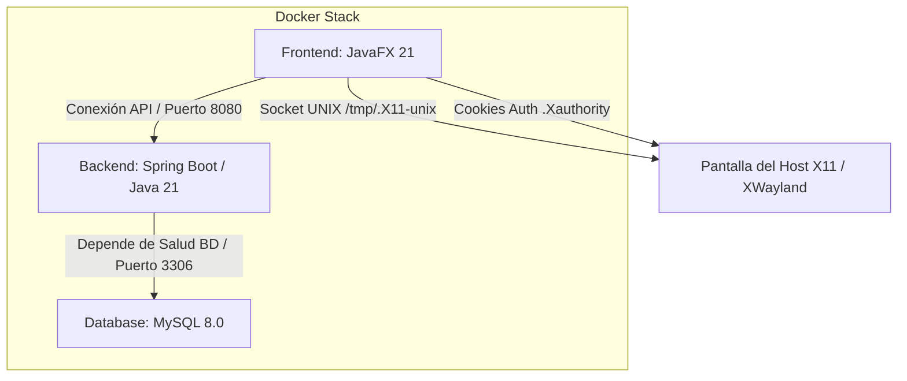

# 🚀 De Cero a Héroe: Dockerizando una Arquitectura de Escritorio (JavaFX 21), Spring Boot y MySQL con Seguridad SELinux

¿Alguna vez has intentado dockerizar una aplicación gráfica de escritorio (GUI) en Linux y te has topado con un muro de permisos del servidor X11 o de directivas SELinux? 🤯

Aquí te presento la arquitectura y la estrategia de automatización que he diseñado para contenerizar **HamBooking** (un sistema integrado de reservas), resolviendo problemas complejos de comunicación inter-proceso (IPC), seguridad del kernel y optimización de capas en Docker.

---

## 🏗️ La Arquitectura de Contenedores

La solución consta de tres capas perfectamente orquestadas mediante **Docker Compose (v3.8)**:

1. **`hambooking-db` (MySQL 8.0)**: Capa de persistencia aislada con volumen persistente, carga automática de esquemas DDL iniciales e indicador de salud (`healthcheck`) basado en `mysqladminping`.
2. **`hambooking-backend` (Spring Boot 3.x / Java 21)**: API REST construida mediante imágenes multi-stage y empaquetada en un entorno JRE mínimo. Depende directamente de la salud de la BD (`condition: service_healthy`).
3. **`hambooking-frontend` (JavaFX 21 / OpenJFX)**: El cliente gráfico de escritorio ejecutándose dentro de un contenedor Linux, compartiendo la red del host (`network_mode: host`) y proyectando su interfaz en el monitor físico del usuario a través de X11/XWayland.

---

## 🛠️ Los Desafíos de Ingeniería y sus Soluciones

### 1. El Muro de Seguridad SELinux y X11 Forwarding
**El Reto**: Aunque compartíamos el socket `/tmp/.X11-unix` y la cookie `${XAUTHORITY:-~/.Xauthority}` usando banderas de relabeling (`:ro,z`), SELinux (en hosts como Fedora/RHEL) bloqueaba la conexión inter-proceso (IPC), lanzando un frustrante `java.lang.UnsupportedOperationException: Unable to open DISPLAY`.
**La Solución**: Desactivar específicamente el confinamiento de etiquetas gráficas de SELinux para el servicio del frontend en Docker Compose mediante `security_opt: [ "label=disable" ]`. Esto permite al proceso contenedorizado acceder al socket X11 de manera segura en desarrollo local.

### 2. Bypass de Forks en Ejecución de Maven
**El Reto**: Usar `javafx-maven-plugin` para levantar la aplicación en caliente causaba que Maven creara un subproceso hijo (`fork`). Este proceso hijo no heredaba los descriptores visuales de X11 (`DISPLAY`) del contenedor y se tragaba las trazas de errores.
**La Solución**: Separar la fase de construcción de la ejecución. Durante el build de la imagen Docker compilamos (`clean compile`) y extraemos las librerías necesarias (`dependency:copy-dependencies`). En tiempo de ejecución (`CMD`), llamamos al binario de `java` directamente con `--module-path` y el parámetro de renderizado por software `-Dprism.order=sw`.

### 3. Alineación de UID/GID sin Root
**El Reto**: Las imágenes base modernas de Eclipse Temurin vienen con un usuario preconfigurado (`ubuntu` con UID 1000) que impedía mapear nuestro propio usuario `developer` con UID 1000, provocando fallos de escritura y permisos cruzados con el host.
**La Solución**: Limpiar el sistema de usuarios en la fase de construcción eliminando el usuario preexistente (`userdel -f ubuntu`) antes de crear y delegar la ejecución a un usuario de desarrollo sin privilegios de root (`USER developer:1000`).

---

## ⚡ Automatización en un Solo Clic: El Makefile Orquestador

Para evitar que los desarrolladores recuerden comandos engorrosos de configuración gráfica (`xhost`) y parámetros de red, creamos un `Makefile` raíz que automatiza todo el ciclo de vida:

* `make up`: Otorga permisos locales de renderizado (`xhost +local:`) e inicia todo el stack en primer plano.
* `make up-d`: Arranca los servicios en segundo plano.
* `make clean`: Apaga el stack y limpia completamente las redes y los volúmenes de datos.
* `make frontend` / `make backend` / `make db`: Permite levantar y testear componentes de manera aislada para agilizar el debug.

---

## 💡 Aprendizajes Clave para Compartir (Key Takeaways)

* **Separación de responsabilidades en Dockerfile**: Nunca uses wrappers de construcción en tiempo de ejecución (como ejecutar `mvn compile` en el CMD). Construye en el build y ejecuta con la JVM pura.
* **El contexto del Sistema Operativo importa**: Si empaquetas una app de escritorio, la base del contenedor debe usar `glibc` (no `musl` de Alpine) debido a las dependencias de librerías compartidas gráficas de GTK y X11.
* **Seguridad de aislamiento de Docker**: Entender las diferencias entre permisos Unix tradicionales (propietario/grupo) y políticas del kernel Linux (SELinux) es la clave para desbloquear aplicaciones complejas en entornos empresariales.

---

# 🔗 ¿Te has enfrentado a problemas similares con aplicaciones legacy o de escritorio en Docker? ¡Déjame tus comentarios abajo! 👇

#DevOps #Docker #Java #JavaFX #SpringBoot #SoftwareArchitecture #LinuxSecurity #SELinux
